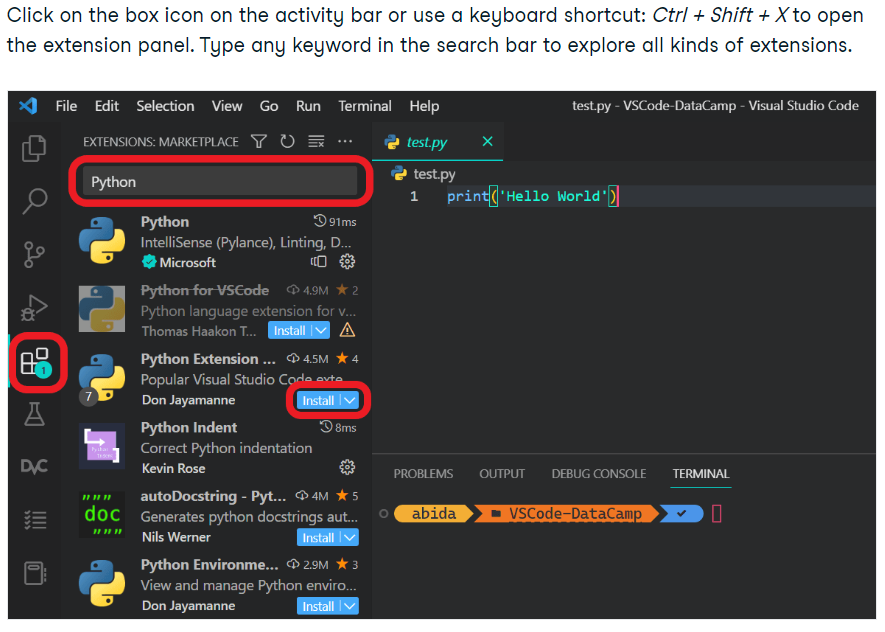
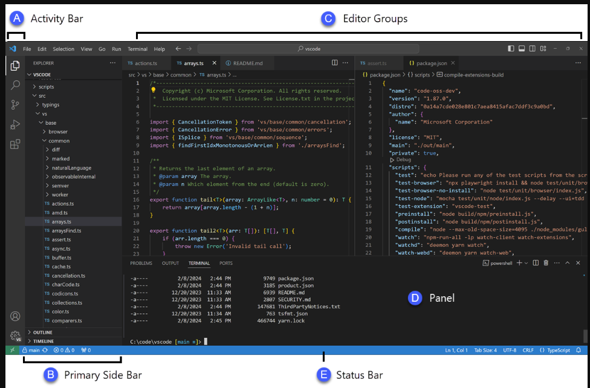
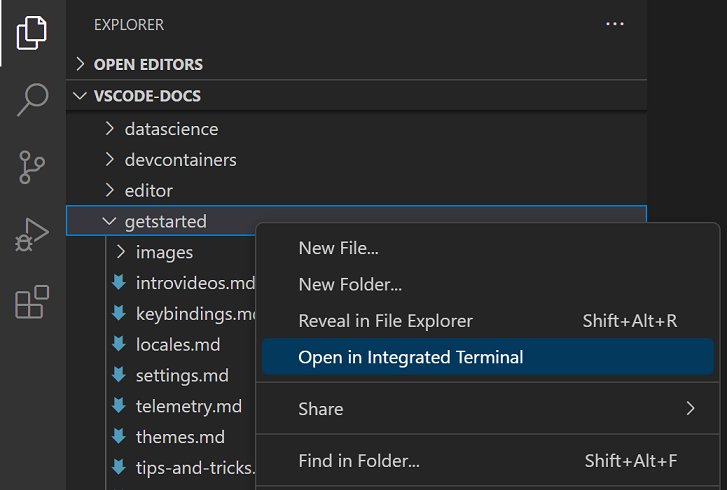
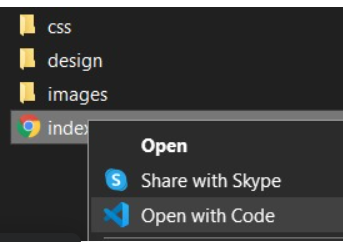

# SE-Assignment-5
Installation and Navigation of Visual Studio Code (VS Code)
 Instructions:
Answer the following questions based on your understanding of the installation and navigation of Visual Studio Code (VS Code). Provide detailed explanations and examples where appropriate.

 Questions:

1. Installation of VS Code:
   - Describe the steps to download and install Visual Studio Code on Windows 11 operating system. Include any prerequisites that might be needed.

   To download and install Visual Studio Code (VS Code) on a Windows 11 operating system, follow these steps:

Prerequisites:
-A working internet connection.
-Sufficient disk space for the installation.
-Windows 11 operating system.
Steps:
1.Open a Web Browser:
Launch your preferred web browser on your Windows 11 computer.

2.Navigate to the Visual Studio Code Website:
Go to the official Visual Studio Code website by entering the following URL into the address bar: https://code.visualstudio.com/

3.Download Visual Studio Code:
On the Visual Studio Code website, click on the "Download for Windows" button. This will start the download of the Visual Studio Code installer (.exe file).

4.Run the Installer:
Once the download is complete, locate the downloaded installer file (usually in your Downloads folder) and double-click on it to run the installer.

5.User Account Control (UAC) Prompt:
If prompted by User Account Control (UAC), click "Yes" to allow the installer to make changes to your device.

6.Start the Installation:
The installer window will appear. Click on the "Next" button to proceed with the installation.

7.Read and Accept the License Agreement:
Review the Visual Studio Code license agreement. If you agree to the terms, select the "I accept the agreement" option, then click "Next."

8.Choose Destination Folder:
Choose the destination folder where you want to install Visual Studio Code. By default, it will install in C:\Program Files\Microsoft VS Code. You can click on "Browse" to choose a different location if needed. Click "Next" to continue.

9.Select Start Menu Folder:
Choose the folder where you want Visual Studio Code shortcuts to be placed in the Start menu. Click "Next" to proceed.

10.Select Additional Tasks:
Optionally, you can choose whether to create desktop and Quick Launch icons, as well as whether to add VS Code to the system PATH for easy command-line access. Make your selections and click "Next."

11.Install:
Review the installation settings one last time, then click on the "Install" button to begin the installation process.

12.Wait for Installation to Complete:
The installer will now extract and install the necessary files. Wait for the process to complete.

13.Launch Visual Studio Code:
Once the installation is finished, you can choose whether to launch Visual Studio Code immediately by leaving the "Launch Visual Studio Code" option checked. Click "Finish" to complete the installation.

14.Start Coding:
Visual Studio Code is now installed on your Windows 11 computer. You can launch it from the Start menu or desktop shortcut and start coding!

2. First-time Setup:
   - After installing VS Code, what initial configurations and settings should be adjusted for an optimal coding environment? Mention any important settings or extensions.
   
    Essential Vs code pyhton extentions should be installed. These include; Indent-rainbow,Python Indent,Jupyter Notebook Renderers, and autoDocstring
Integrated Terminal:
Customize the integrated terminal settings, such as the default shell and terminal font, to match your preferences.

Keybindings:
Customize keybindings or learn the default keybindings to improve your productivity. You can access keybindings by clicking on the gear icon in the bottom left corner of VS Code and selecting "Keyboard Shortcuts."

File Associations:
Ensure that file associations are correctly set up for the types of files you'll be working with. You can adjust file associations in the VS Code settings.

Workspace Settings:
Consider setting up workspace-specific settings for different projects if needed. Workspace settings override user settings and are stored inside the .vscode directory of your project.

Version Control Integration:
If you're working with version control, configure VS Code to use your preferred version control system (e.g., Git) and adjust related settings.

3. User Interface Overview:
   - Explain the main components of the VS Code user interface. Identify and describe the purpose of the Activity Bar, Side Bar, Editor Group, and Status Bar.
   
   Editor Area:
The editor area is where you write and edit your code. Each file you open in VS Code will have its own editor tab, allowing you to work on multiple files simultaneously. The editor supports syntax highlighting, code folding, and various other features to enhance your coding experience.

Sidebar:
The sidebar, located on the left side of the window by default, contains several panels that provide access to different aspects of your project:

Activity Bar:
The activity bar, located along the left side of the window, contains icons representing different activities or views in VS Code. 

Status Bar:
The status bar is located at the bottom of the window and provides information about the current state of your project and editor.

Title Bar:
The title bar is at the top of the window and contains the name of the current project or file being edited. It also includes minimize, maximize, and close buttons for the VS Code window.

Menu Bar:
The menu bar, located at the top of the window on Windows and Linux (and at the top of the screen on macOS), contains menus with various commands and options for working with files, editing, view configuration, and more. Some common menus include File, Edit, View, Go, and Help.

Activity Bar:  
Explorer: Opens the Explorer sidebar panel.
Search: Opens the Search sidebar panel.
Source Control: Opens the Source Control sidebar panel.
Debug: Provides access to debugging features.
Extensions: Opens the Extensions sidebar panel.
Remote Explorer: Allows you to manage remote connections and workspaces.

Side Bar:
Explorer: Displays the file and folder structure of your project, allowing you to navigate and manage files.
Search: Provides search functionality within your project files.
Source Control: Integrates with version control systems like Git, displaying changes, branches, and commit history.
Extensions: Allows you to manage installed extensions and discover new ones from the VS Code Marketplace.

Editor Group:
The editor supports syntax highlighting, code folding, and various other features to enhance your coding experience

Status Bar:
Language Mode: Displays the language mode of the current file.
Line Endings: Indicates the line ending format used in the current file.
Encoding: Shows the encoding format of the current file.
Indentation: Displays the indentation settings of the current file.
Editor Mode: Indicates whether the current file is in insert or overwrite mode.
Git Branch: Shows the current Git branch (if applicable).
Errors and Warnings: Displays diagnostic information such as errors and warnings in your code.

4. Command Palette:
   - What is the Command Palette in VS Code, and how can it be accessed? Provide examples of common tasks that can be performed using the Command Palette.

The Command Palette in Visual Studio Code (VS Code) is a powerful tool that allows you to access and execute various commands and actions within the editor. It provides a quick and efficient way to perform tasks without using the mouse or navigating through menus.
Using Keyboard Shortcut:
The most common way to open the Command Palette is by using the keyboard shortcut:
On Windows and Linux: Press Ctrl + Shift + P.
On macOS: Press Cmd + Shift + P.
Using Menu Option:
Alternatively, you can access the Command Palette through the menu:Click on the "View" menu in the menu bar at the top of the VS Code window.Select "Command Palette" from the dropdown menu.

You can use the Command Palette to perform various tasks, such as:

Running commands to execute specific actions (e.g., "Open File," "Save All," "Toggle Line Comment").
Accessing editor features and settings (e.g., changing the color theme, configuring settings).
Installing and managing extensions.
Running tasks and debugging commands.
Navigating to specific files, symbols, or lines within your project.

5. Extensions in VS Code:
   - Discuss the role of extensions in VS Code. How can users find, install, and manage extensions? Provide examples of essential extensions for web development.

Enhancing Features: Extensions augment core functionalities, introducing support for various programming languages, debugging capabilities, and advanced editing tools.

Customization: They enable users to personalize their coding environment with themes, keybindings, and visual enhancements.

Productivity Tools: Extensions offer tools for code linting, formatting, and refactoring, boosting developer efficiency.

Integration: They seamlessly integrate with version control systems, testing frameworks, and external services, facilitating collaboration and workflow automation.

Community Contribution: The diverse extension ecosystem, driven by community contributions, ensures a wide range of functionalities catering to diverse developer needs.

Finding Extensions:
Users can search and browse for extensions in the VS Code Marketplace.

Installing Extensions:
Extensions can be installed directly from within VS Code or from the VS Code Marketplace website.

Managing Extensions:
Users can manage installed extensions from the Extensions view in VS Code, adjusting settings, enabling/disabling, uninstalling, and updating extensions as needed.

Here's a summary list of essential extensions for web development in Visual Studio Code:
ESLint: JavaScript linter for code quality and standards.
Prettier: Code formatter for consistent code style.
Live Server: Local development server with live reloading.
Debugger for Chrome: Debugging tool for JavaScript in Chrome.
HTML CSS Support: Auto-completion for HTML and CSS.
Auto Close Tag / Auto Rename Tag: Automated HTML tag management.
Path Intellisense: Auto-completion for file paths.
GitLens: Enhanced Git integration for version control.
Bracket Pair Colorizer: Colorizes matching brackets for readability.

6. Integrated Terminal:
   - Describe how to open and use the integrated terminal in VS Code. What are the advantages of using the integrated terminal compared to an external terminal?
To open the integrated terminal in Visual Studio Code, you can follow these steps:

1. Launch Visual Studio Code.
2. Once it's open, navigate to the menu bar at the top of the window.
3. Click on the "View" menu.
4. From the dropdown menu, select "Terminal" or use the keyboard shortcut Ctrl+` (backtick). This will open the integrated terminal at the bottom of the editor.

Advantages of using the integrated terminal compared to an external terminal include:

1. Seamless Integration: The integrated terminal is directly built into the IDE, allowing for a smoother workflow without needing to switch between different applications.

2. Contextual Awareness: It automatically opens to the workspace directory, providing context-specific commands and shortcuts tailored to your project.

3. Productivity: Quickly access terminal commands without leaving the IDE, saving time and reducing context-switching overhead.

4. Customization: Easily customize terminal settings, font sizes, color themes, and other preferences to suit your workflow.

5. Debugging: Conveniently run debugging commands alongside your code, enabling efficient debugging workflows without toggling between multiple windows.

7. File and Folder Management:
   - Explain how to create, open, and manage files and folders in VS Code. How can users navigate between different files and directories efficiently?
   While installing the VS Code, we get an option to tick for Open with Code. The image below shows when I'm opening a file:
   

Creating Files and Folders:

To create a new file, you can use the keyboard shortcut Ctrl+N (Cmd+N on macOS), or navigate to the File menu and select "New File".
To create a new folder, use the keyboard shortcut Ctrl+Shift+N (Cmd+Shift+N on macOS), or right-click within the file explorer pane and select "New Folder".

Opening Files and Folders:

To open an existing file, you can use the keyboard shortcut Ctrl+O (Cmd+O on macOS), or navigate to the File menu and select "Open File".
To open an entire folder, use the keyboard shortcut Ctrl+K Ctrl+O (Cmd+K Cmd+O on macOS), or navigate to the File menu and select "Open Folder".

Managing Files and Folders:

To rename a file or folder, right-click on it in the file explorer pane and select "Rename", or use the keyboard shortcut F2.
To delete a file or folder, right-click on it in the file explorer pane and select "Delete", or press the Delete key.
To move or copy files or folders, you can simply drag and drop them within the file explorer pane or use the context menu options.

Users can navigate the directory structure to access files and directories. This can be done through both command-line interfaces (using commands like cd, dir, or ls) and graphical user interfaces (using file managers).

8. Settings and Preferences:
   - Where can users find and customize settings in VS Code? Provide examples of how to change the theme, font size, and keybindings.

 Users can find and customize settings in VS Code by using the Settings editor to review and change VS Code settings. To open the Settings editor, navigate to File > Preferences > Settings. Alternately, open the Settings editor from the Command Palette (Ctrl+Shift+P) with Preferences: Open Settings or use the keyboard shortcut (Ctrl+,).

Change Theme:
-Open Settings (right-click the Start button or press Win + I).
-Click Personalization in the sidebar.
-Under Themes, select a theme from the available options or create a custom one .

Change Font Size:
-Open Settings.
-Click Accessibility in the sidebar.
-Select Text Size and adjust the slider to make the font bigger or smaller

Change Keybindings:
-Use the Keyboard Manager utility (part of Microsoft PowerToys):
-Download PowerToys.
-Enable Keyboard Manager and customize key remappings
9. Debugging in VS Code:
   - Outline the steps to set up and start debugging a simple program in VS Code. What are some key debugging features available in VS Code?

1. Install VS Code: Download and install it from the official website if you haven’t already.
2. Open your project: Launch VS Code, go to ‘File’ > ‘Open Folder’ and select your project directory.
3. Install necessary extensions: For example, if you’re coding in Python, install the Python extension from the marketplace.
4. Configure launch.json file: Go to the ‘Run’ view (Ctrl+Shift+D), and click ‘create a launch.json file’, then select the environment that matches your programming language.
5. Write your code: Create a new file or open an existing one and write your simple program.
6. Set breakpoints: Click on the left margin next to the line numbers where you want the debugger to pause execution.
7. Start Debugging: Press F5 or click on the green play button in the ‘Run’ view to start debugging.

Here are some key debugging features;

Breakpoints: Set, disable, and remove breakpoints.
Variable Inspection: Hover over variables to see values or inspect them in the ‘Variables’ pane.
Step Over/Into/Out: Navigate through your code one line or function at a time.
Call Stack: View the call stack to see the function call hierarchy.
Watch Expressions: Evaluate expressions on the fly and watch their values change.
Console: Access the integrated terminal/console for output or to run commands.
Multi-threaded Debugging: Manage and debug multiple threads if your program uses concurrency.

10. Using Source Control:
    - How can users integrate Git with VS Code for version control? Describe the process of initializing a repository, making commits, and pushing changes to GitHub.
    
By opening a GitHub repository in a codespace through the following steps;
1. Install the GitHub Codespaces extension in VS Code and sign in with your GitHub account.
2. Run the Codespaces: Create New Codespace command.
3. Select the repository and branch you want to open. VS Code opens a new window, which is connected to the codespace

Process of initializing a repository, making commits, and pushing changes to GitHub is as follows;

1. Install Git: Ensure Git is installed on your system.
2. Open your project: In VS Code, open the folder containing your Git repository.
3. Source Control View: Click on the Source Control icon (or press Ctrl+Shift+G) to access Git features.
4. Initialize Repository: If not already a Git repo, initialize it by clicking ‘Initialize Repository’.
5. Stage Changes: Click ‘+’ to stage changes or use the context menu for specific files.
6. Commit Changes: Enter a commit message and press Ctrl+Enter to commit staged changes.
7. Branch Management: Create, switch, and merge branches using the branch icon in the Source Control view.
6. Push and Pull: Sync changes with remote repositories using the ‘…’ menu for push and pull commands.

Sources: 
https://stackoverflow.com/
https://www.datacamp.com/tutorial/setting-up-vscode-python
https://code.visualstudio.com/docs/getstarted/userinterface#_basic-layout
https://chatgpt.com/
https://medium.com/@akshay.sharma81296/navigating-directory-structure-in-os-a-practical-guide-fe24f4fa67ac#:~:text=Users%20can%20navigate%20the%20directory,interfaces%20(using%20file%20managers).

 Submission Guidelines:
- Your answers should be well-structured, concise, and to the point.
- Provide screenshots or step-by-step instructions where applicable.
- Cite any references or sources you use in your answers.
- Submit your completed assignment by 1st July 

